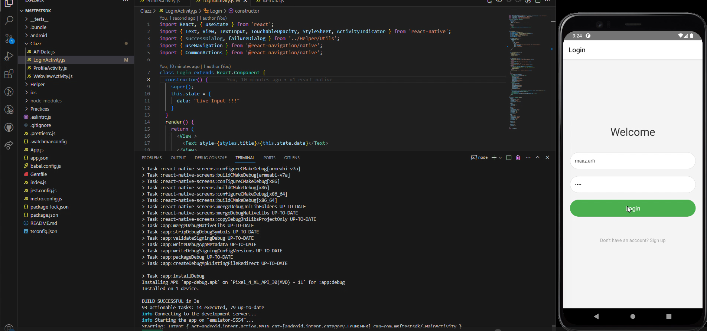

# Getting Started

## Note: Project Uses (Npm) throughout the whole code.

# Output

[](https://youtu.be/PVkXkhf3Sa8)


>**Note**: Make sure you have completed the [React Native - Environment Setup](https://reactnative.dev/docs/environment-setup) instructions till "Creating a new application" step, before proceeding.

## Required dependencies

First, you will need to start **Install**, the following libs.

```bash
# using npm
npm install @react-navigation/native
```

```bash
# using npm
npm install react-native-screens react-native-safe-area-context
```

```bash
# using npm
npm install @react-navigation/native-stack
```

## For API view Design

You will need to start **React Native Paper** .

```bash
# using npm
npm install react-native-paper
```

[]


## Step 1: Start the Metro Server

First, you will need to start **Metro**, the JavaScript _bundler_ that ships _with_ React Native.

To start Metro, run the following command from the _root_ of your React Native project:

```bash
# using npm
npm start
```

## Step 2: Start your Application

Let Metro Bundler run in its _own_ terminal. Open a _new_ terminal from the _root_ of your React Native project. Run the following command to start your _Android_ or _iOS_ app:

### For Android

```bash
# using npm
npm run android
```

### For iOS

```bash
# using npm
npm run ios
```

If everything is set up _correctly_, you should see your new app running in your _Android Emulator_ or _iOS Simulator_ shortly provided you have set up your emulator/simulator correctly.

This is one way to run your app — you can also run it directly from within Android Studio and Xcode respectively.

## Step 3: Modifying  App

Now that you have successfully run the app, let's modify it.

1. Open `App.js` in your editor it contains [React Navigation - Routes](https://reactnavigation.org/) you can add and modify those stack routes.
2. Project uses **JSONPlaceholder**: APIs to modify these APIs open  `./Clazz/ProfileActivity.js`!

   For **Design of API Response**: open <kbd>./Clazz/APIData.js</kbd> in your editor and make changes and reload the app and see your changes!

## Congratulations! :tada:

You've successfully run and modified your React Native App. :partying_face:

